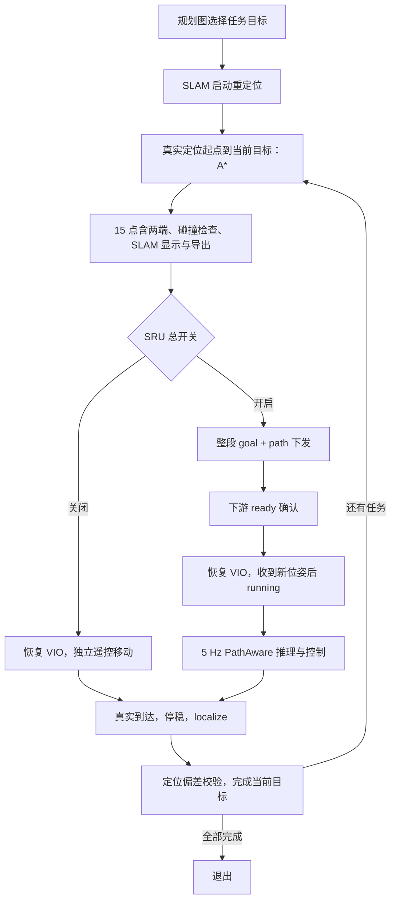

# 现场测试与上下文交接（2026-09-29）

这是截至 2026-09-29 的项目状态、已确认需求与对话决策摘要，供 2026-09-30 继续测试。它不是平台完整逐字聊天导出；新会话读取本文后可以恢复项目背景，再以现场日志和当前文件为准。

## 2026-10-08 追加：地图选点时显示 A* 参考点

用户要求“在当前地图选点后，把 A* 的点也可视化显示出来”。已在现有 `scripts/task_point_picker.py` 中实现：至少两个目标时，后台自动预览相邻目标路线；蓝色当前路线及 15 点编号，灰蓝色其他路线；左右键切段、F 放大、Tab 切目标/参考表、P 保存 PNG/JSON。已有目标自动载入并预览，启动命令仍为 `./run_task_nav.sh --pick-only`。详细操作见 [分段 A* 快速使用](分段A星接入_快速使用.md) 的“选点时查看 A*”。

首段缺少真实重定位起点，不虚构“启动位置→目标 1”。预览使用正式规划器的同一几何实现及居中参数，但结果明确标为 `preview_only`，不具有调度事件字段、不下发、不写入任务文件。正式运行仍以每次真实重定位重新规划。带 `--task-points-file` 启动会跳过选点窗口，需先 `--pick-only` 查看。

新增 `scripts/task_path_preview.py`，单后台线程处理规划、取消和缓存；清空、撤销、关闭会取消旧请求，过期结果不会覆盖当前画面。`scripts/task_nav_astar.py` 提取共用几何函数并提供只读 `preview()`；未修改调度器导航流程、VIO、速度配置或正式目标。

当前 5 个目标的 4 条相邻预览都包含 15 个参考点、保留精确起终点、全部连线可通行。21 项相关测试通过；UI 最终排版另通过 5 项复测，无界面效果图及数据保存在 `logs/astar_picker_preview_20261008/`。这是离线/UI 逻辑验证，没有启动真实相机或机器人。修改前备份：`/home/amov/architecture_backups/astar_visualization_before_20261008_040117/`。

## 当前状态：VIO 衔接和居中规划已修复（2026-09-30）

**已修改正式运行代码，尚未实机复测。** 上次网络中断前的改动和测试日志已保留，本次完成当前配置的离线验证及说明。先读 [VIO 衔接与居中规划：修复与复测](VIO衔接与居中规划_修复复测_20260930.md)。

- VIO tracker 由相机线程创建和切换；预热时恢复 IMU，定位前等待图像/IMU 两线程挂起确认，结束后确认新 VIO 生效才发布定位结果。定位成功、失败、取消均清理旧队列并重置局部基线，避免跨代累积。修正暂停空转、冷却拒绝遗留 busy 和临时 tracker 引用。
- 为 VIO/定位 tracker 分开维护 IMU 时间线；跳过缺少新鲜 IMU 或明显积压的图像。增加实际 tracker 代次/ID、track 墙钟与线程 CPU 耗时记录，方便继续查原生调用卡顿。
- `config/task_nav.yaml → astar.center_preference` 默认开启：衰减距离 0.8 m、权重 4、简化容差 0.10 m、每次简化允许净空损失 0.05 m。真实起终点、15 点、地图硬障碍规则保持原约定。
- 上游 38 项、下游 85 项离线测试通过；当前 5 个目标的假设起点预规划及 3 条历史真实定位路线回放均通过 15 点/端点/连线检查。第一段最小地图净空 0.538 → 0.891 m，第二段 0.636 → 0.814 m。见 [正式规划器对比图](logs/vio_center_fix_20260930/production_routes.png) 和 [路径验证数据](logs/vio_center_fix_20260930/planning_validation.json)。后续段的实际起点仍必须重新定位，离线结果不能保证任意重定位位置都可规划。
- 用户的 `nav_pathaware.yaml`、5 个任务点保留；没有改停车阈值、标注或地图数据库。修改前文件及 SHA256 在 `/home/amov/architecture_backups/vio_center_fix_before_20260930_121603/`。

下一步：重启进程，开启诊断先做 `--no-sru` 静止/暂停后 `localize` 对照，再测试 `--sru`。观察新报告第 3 节的 tracker 代次表、IMU 拒绝原因和长 track 时刻。原生库内部耗时与 IMU 外参问题仍待实测确认，不能声称漂移已经消除。

恢复对话可直接说：**“继续 `/home/amov/navside_real/NavSide_log/Navside-9.1` 的 VIO 衔接与居中规划复测，先读交接文档顶部和 `VIO衔接与居中规划_修复复测_20260930.md`，本轮诊断目录是……。保留 15 点含起终点、人工停车后 localize 和当前停车参数，先分析日志。”**

## 2026-09-30 追加：位姿等待恢复（优先于下文旧状态）

**以下是修复前的排查记录，当前实现状态以上一节为准。** 上游卡顿/IMU 衔接排查与居中规划离线方案的详细证据见下方“上游与规划专项排查”。当时只修改 `--check-only` 的中文提示，明确选点应使用 `--pick-only`；当时上游运行逻辑及正式 A* 算法没有改动。现有 5 个目标检查通过，候选路径保留 15 点及硬障碍规则。随后已按用户要求接入，见顶部。

**最新：09:46 实测及 report.md 中文判读改版。** 该轮 346 个发送/接收包匹配，坐标无不一致，发送→接收最大 4.07 ms；一次自动等待对应上游 track 用时 1.321 s、发包/收包空窗 1.545 s，等待后恢复。另有人工暂停、A* 实际重定位起点不可通行、视觉重定位失败；这些原因分开判断。159.340 s 收包间隔跨暂停/重定位，不能当成网络延迟。tracker 主线程新建对象与后续相机帧实际使用对象不同、暂停期间 IMU 时间差大是待查线索，尚不能据此确认漂移根因。先读[本轮中文报告](logs/pose_diag/run_20260930_094636_102098/report.md)。以后同样运行 `python3 scripts/pose_diagnostics.py report --latest` 自动输出结论、事件证据、易误判指标、下一步排查；脚本没有修改导航运行逻辑。报告改版前备份：`/home/amov/architecture_backups/pose_report_before_20260930_105939/`。

**最新：07:11/07:26 两轮后加入位姿链路诊断**。用户把位置阈值改为 1.5 m、目标改为 5 个，本次保留。第二轮两次短等待恢复后报 42.6849 m 跳变；原始 VIO Rerun 在同两帧、0.10007 s 内已有 43.0934 m 三维跳变，严重异常来自 VIO 输出阶段，具体输入/跟踪原因待查。新增可选逐包诊断：原始 VIO/IMU → 发送 → 接收 → SRU 实际推理输入 → 停车事件，以 UUID/序号/相机时间关联；不改停车授权规则。先读[位姿链路诊断快速使用](位姿链路诊断_快速使用_20260930.md)，脚本 `scripts/pose_diagnostics.py prepare/watch/report/existing`。默认关闭，开启需 source prepare 生成的环境文件并重启上下游；诊断使用扩展包，新接收器兼容旧包。原有 64 项回归与 12 项新测试通过，尚未实机采集新版诊断。

**最新：06:46 实测后的积压修复**。用户确认零速停车后没有搬动。`pose_jump_requires_localize` 记录偏移 1.0033 m；原 Rerun 显示约 1.7 s 的采样在约 0.3 s 内追赶输出。上游改为最新结果队列、取帧后过期结果不发送、调度器仅从新采样接收到达位姿；下游区分相邻跳变与跨断流累计偏移，并增加静止稳定窗口后才自动恢复。人工停车/长断流/非法或超限跳变仍须 localize。已通过 70 项离线测试与 7 个目标预检，尚待新版实机验证。先读[位姿积压修复与复测](位姿积压修复与复测_20260930.md)，原录制和修改前文件保存在 `architecture_backups/pose_backlog_before_20260930_065554/`（相对 `/home/amov`）。

初始定位补充：调度器启动/SLAM 重启会读取地图 `*_last_pose.txt` 作为猜测；正常段间/人工重定位使用当前全局 VIO 的 XZ、Y=0 和单位姿态，失败后可用文件猜测重试。用户先单独 localize 的用意是更新初始猜测，可以成功后**正常退出**刷新文件，再启动调度器；不能同时占用 MZ 相机。强杀不保证 last-pose 文件更新。

**06:30 后实测复盘**：已读取 `Desktop/test（复件）.txt`。第一轮两次短断流均恢复，目标 2 的视觉地图匹配失败；第二轮检测到位置变化 1.5102 m 而保持停车。MZ/J0 当前均能枚举，但 MZ 为 480 Mbps 且有 USB 描述符读取超时。用户确认插拔过一次，不能把全部断开记录定性为自动掉线。调度器已修复关停时提前停止读取 NavSide 退出确认的缺陷；启动只需调度器。详见[两轮实测排查与启动顺序](两轮实测排查与启动顺序_20260930.md)，本次记录在 `logs/test_review_20260930_0630/`。

已分析 `/home/amov/Desktop/test.txt`；`pose_stale_or_invalid` 是下游位姿检查停车，与墙体厚度无关。日志另有起点不可通行的规划失败，需分别排查。用户确认改为短超时先零速保留路径、稳定恢复后继续；长断流/突变/非法数据及人工停车须 `localize`。

现已接入 `WAIT_POSE` / `waiting_pose` / `pose_resumed`。默认包龄 1 s，等待最多约 5 s，连续稳定 0.6 s 且至少 3 个不同新包才恢复；阈值见 `config/nav_pathaware.yaml`。坐标系连续性通过重定位/重启事件及位姿变化检查，现有 UDP 无源坐标系编号，不能严格识别小幅连续坐标系变化。55 项离线测试通过，真机效果待验证。正式 `config/task_points_selected.json` 已存在。

继续工作先读[位姿等待恢复测试说明](位姿等待恢复_测试说明_20260930.md)，测试记录在 `logs/pose_recovery_20260930/tests.log`，修改前备份在 `/home/amov/architecture_backups/pose_recovery_before_20260930_052112/`。下一步重启调度器实测，优先查看新日志的 `pose_age_s`、`wait_s`、`stable_samples` 和异常原因；不因位姿超时盲改地图标注。

## 上游与规划专项排查（2026-09-30）

本节保留修复前的代码审计、原始日志和候选方案；其中“建议”“尚未接入/修复”描述的是当时状态。当前已实现部分、参数、验证及后续实测入口见本文顶部。

### 先看结论

**tracker / IMU 衔接存在可由代码直接确认的缺陷，值得优先修复；但不能把本轮所有 track 卡顿或现场漂移都归因于其中某一项。** 本轮证据来自 `run_20260930_094636_102098`，未启动相机或机器人复测。

| 已确认的问题 | 代码位置 | 为什么会影响连续性 |
|---|---|---|
| 主线程重建 VIO tracker，相机线程一直用启动时传入的旧对象 | 上游 `orbbec/run_vio_tasknav.py`：`camera_thread(tracker, ...)` 与定位结束后的 `tracker = make_tracker(slam=False)` | 主线程赋值没有传递给相机线程；413 帧始终是同一个 worker tracker ID。4 次有后续帧的重建均未切换，另一次重建后没有帧可验证 |
| 人工/调度暂停后请求 localize，没有解除 IMU 暂停 | 同文件 `request_anchor()`、相机预热分支及 `imu_thread()` | 相机优先处理定位请求，能读新图像；IMU 因共享 `pause_event` 仍置位而停止取样。出现新图像配旧 IMU，实测最大时间差 73.320 s |
| 暂停循环空转 | 两个采集线程中的 `pause_event.wait(0.2)` | Event 已置位时 wait 立即返回，形成循环而非休眠；增加 CPU/GIL 竞争。这是暂停时的缺陷，不直接证明行进中的 1.321 s 卡顿就是它造成 |
| 定位预热与行进共用时间戳/IMU 缓存 | 相机线程 `pending_imu`、`last_tracker_timestamp` | 两种 tracker 没有独立生命周期。预热 `anchor_trk.track(ts)` 后也未将时间戳下界推进到该图像 ts，迟到 IMU 可能违反注册与 Track 的时间顺序 |
| 临时定位 tracker 未必在 holder 清空后释放 | 相机线程局部变量 `anchor_trk` | 它仍持有对象引用；不能认为 `holder["anchor_tracker"] = None` 就已释放全部定位资源。额外 GPU/内存影响尚未量化 |
| 冷却拒绝仍提前设置 busy | `request_anchor()` 先设置 `localize_busy=True`，再检查冷却并 return | 短时间重试可能进入没有实际请求的等待状态；应在通过冷却校验后才进入 busy |

前三项在 06:55 的代码备份中已经存在，不是这次 report.md 排版改动引入。备份位置：`/home/amov/architecture_backups/pose_backlog_before_20260930_065554/upstream/orbbec/run_vio_tasknav.py`。

### track 卡顿已经查到哪一层

| 跟踪结束时间（UTC） | track 耗时 | 附近 IMU 源时间戳最大缺口 | 调用前最后 IMU 与本帧图像差 |
|---|---:|---:|---:|
| 09:46:55.231 | 1.321 s | 1.263 s | 4.41 ms |
| 09:47:01.316 | 0.801 s | 0.746 s | 3.33 ms |
| 09:50:26.184 | 0.736 s | 0.696 s | 2.69 ms |

长调用前 IMU 尚新，长调用几乎结束时 IMU 记录才成批出现，并出现源时间戳缺口；应用 IMU 队列记录的丢弃数为 0。证据支持“跟踪长调用期间，IMU 采集线程未能及时持续消费”的方向，不能把这解释成单纯 JSON 写盘晚了。源时间戳缺口的位置仍需区分 SDK 缓冲丢帧、设备流断续与线程调度。

第一处对应下游 1.545 s 无新包及 `pose_stale`，之后自动恢复。重叠的 SRU 推理约 28～34 ms，发送→接收最大 4.07 ms；没有证据支持把这次等待归因于长时间 UDP 传输或一次很慢的 SRU 推理。但 SRU 正常耗时并不能完全排除两个进程争用 GPU。

**GIL 阻塞是重点怀疑方向，尚不是已证明的底层根因。** 本地 cuVSLAM C++ 源码的 Odometry `track` 绑定在调用 `self.Track()` 时未看到 GIL 释放；nanobind 官方说明长 C++ 调用需要显式释放 GIL 才允许其他 Python 线程并行。但实际部署使用 `venv/.../cuvslam-17.0.0+cu12` 的 aarch64 wheel，不能仅凭旁边源码认定该二进制完全一致。见 [nanobind 调用保护/GIL 文档](https://nanobind.readthedocs.io/en/latest/functions.html#call-guards)。

当前纯 VIO 配置 `slam=None`，实际 Python 包只调用 `odom.track()`，因此不能直接套用旧的“SLAM 回环后端卡住”解释。没有采集 CPU/GPU profiler、线程 CPU 时间、功耗/频率，现阶段无法继续区分惯性优化、GPU 同步/资源争用、CPU 调度。IMU 外参仍为单位旋转和零平移占位，也需要独立标定核对；它与线程衔接问题分别处理。

### 建议的上游修复顺序与验收

1. **先修生命周期与握手。** 相机线程明确接收待切换 tracker，在安全挂起边界执行切换并记录 generation/ID；为 VIO 和定位 tracker 分开管理时间戳下界与 IMU 缓存。不要只改主线程变量。停止使用并释放临时定位对象。
2. **让预热图像配上新 IMU。** 将“禁止向下游发位姿”和“暂停采集”分开；预热时允许图像和 IMU 供数，真正调用 localize 前要等待两个采集线程都确认挂起。修正已置位 Event 的空转等待，取消/冷却也必须恢复一致状态。不能只增加一行 `pause_event.clear()` 就忽略握手。
3. **保持全局基线正确。** 成功定位后，新 tracker 首个有效姿态仅建立局部基线，从真实 anchor 累积。定位失败/超时也可能触发 tracker 重建，必须防止跨新旧局部坐标系做差；不能继续把旧 `last_odom` 接到新 tracker。保留当前未完成目标，不自动解除人工停车。
4. **再定位长调用内部耗时。** 增加 track 的墙钟/线程 CPU 耗时、IMU 读取阶段和图像左右时间戳；必要时用 Jetson CPU/GPU 采样或 Nsight Systems 做短时对照。若确认绑定持有 GIL，再针对纯 C++ Track 调用范围释放，或隔离采集进程；不应把整个 localize/含 Python 回调的函数随意释放 GIL。
5. **验收顺序：** mock 握手/失败/取消测试 → `--no-sru` 静止及已知距离测试 → 暂停后 localize 多轮 → SRU 开启的同场景对照。检查 worker tracker ID 确实切换、预热 IMU 新鲜、时间严格有序、旧队列不跨代、无全局假跳变，最后才判断漂移是否改善。

原始证据摘要：[上游时序核查 JSON](logs/vio_planning_audit_20260930/upstream_timing_audit.json)。离线重现命令：

```bash
cd /home/amov/navside_real/NavSide_log/Navside-9.1
python3 logs/vio_planning_audit_20260930/audit_recording.py
```

### 任务点窗口与检查命令

```bash
cd /home/amov/navside_real/NavSide_log/Navside-9.1
./run_task_nav.sh --pick-only   # 弹出地图，选择并保存任务点
./run_task_nav.sh --check-only  # 只检查已保存的任务点，不弹地图
```

本机 `--check-only` 已通过地图身份及 5 个现有目标检查，未复现“任务点文件不存在”。若另一台机器真的提示缺少文件，查看错误中给出的路径，再 `--pick-only` 保存；当前命令已加明确提示，避免把检查模式当作选点模式。

### 15 点偏向通道中心的方案

**当前没有“靠左行驶”的硬编码。** A* 用路径长度加地图代价；地图 `robot_radius_m=0.5`、安全余量为 0、`soft_band_m=0.3`，当净空达到约 0.8 m 后，代价都降为 0，继续向中心走没有额外好处。起终点位置、较短路线及相同代价时的选路顺序都会影响落在哪一侧。RDP 简化又允许 0.30 m 偏移，只要求不碰障碍，可能把原本离墙更远的折线切向墙边。15 点抽样是在这之后保留转角、分配点数，不是贴墙的主要来源。

**已核对实际路线，简化确实降低了净空：** 第一段原始 A* 密集路线最小净空 0.778 m，最终 15 点连线降到 0.538 m；第二段也从 0.778 m 降到 0.636 m。因此正式修改不能只调 A* 代价，还必须处理简化后的捷径。

建议保留硬障碍判定，加入覆盖整个通道宽度的连续中心偏好，例如：

```text
d = 栅格到障碍/未知区的保守净空
R = 当前机器人半径 + 安全余量（现地图为 0.5 m）
C(d) = exp(-(d-R)/L)                 # 仅用于已可通行格；L 调整偏好范围
每步代价 = 距离 × (1 + w × 两端平均 C)
```

净空越大代价越低，可让路径更偏向中心。相比直接加厚墙体，这种软偏好不会单纯因为想居中就封死窄通道；窄处仍受原硬障碍约束。它是“偏中心”，不承诺在任意开阔区或岔路都精确落到几何中线。Nav2 官方也建议把平滑障碍代价覆盖到通道宽度，见 [Nav2 调参说明](https://docs.nav2.org/rolling/configuration_and_development/tuning_guide/)。

正式接入还需让简化检查净空/代价，避免捷径重新切向墙边。之后保留必要转角，生成 **起点 + 13 个中间点 + 终点**，逐条检查连续线段；若 15 点不足，明确规划失败，不能裁掉转角凑数。真实重定位起点和用户目标保持原坐标，向中线平缓接入，不能把它们偷偷吸附到中心。

离线候选采用 `L=0.8 m`、`w=4`、简化容差 `0.10 m`，是验证思路用的参数，尚未写入正式 YAML 或地图包。

| 本轮路线 | 当前长度 → 候选长度 | 当前最小净空 → 候选最小净空 | 点数/检查 |
|---|---|---|---|
| 第一段首次规划 | 9.26 → 10.13 m | 0.538 → 0.891 m | 均为 15，起终点不变、全部连线可通行 |
| 第一目标前的短距离重规划 | 0.662 → 0.715 m | 0.842 → 0.891 m | 同上 |
| 第二段 | 7.86 → 8.01 m | 0.636 → 0.814 m | 同上 |

这里的净空是地图中的**中心点到障碍/未知区的保守距离**；不能直接当作机器人外壳到真实墙面的距离。例如第一段当前 0.538 m，减去模型半径 0.5 m，模型额外余量只剩约 3.8 cm。候选路线更长，短段也可能产生轻微绕行，正式实现应抑制无意义小绕行，并继续验证模型跟踪效果。

[对比图：橙色当前、紫色只改代价、蓝色改代价并收紧简化](logs/vio_planning_audit_20260930/center_preference_comparison.png)；[数值与 15 点候选坐标](logs/vio_planning_audit_20260930/center_preference_comparison.json)。图中灰色为障碍/未知/膨胀后的不可走区域；绿色越深表示净空越大。

重现离线对比（只生成审查文件，不接入机器人）：

```bash
cd /home/amov/navside_real/NavSide_log/Navside-9.1
.venv_navside/bin/python logs/vio_planning_audit_20260930/compare_center_preference.py
```

本次改动前备份：`/home/amov/architecture_backups/vio_planning_audit_before_20260930_113204/`。

验证：调度器现有 9 项离线测试通过；`--check-only` 实际通过现有 5 个目标检查；离线 3 条候选路径均保持 15 点、精确起终点并通过全部参考线段通行检查。上游缺陷本次只审计，尚未修复或实机验证。

## 1. 明天从哪里开始

| 需要做什么 | 打开哪份文件 |
|---|---|
| 按顺序实测、判断问题在哪一层 | [明日实测步骤与排查](明日实测步骤与排查_20260930.md) |
| 复制所有常用命令，包括地图制作、标注、校验、A*、导航、日志和回退 | [今日产出：全部快速指令](今日产出_全部快速指令_20260929.md) |
| 查导航参数、状态和输出文件含义 | [分段 A* 快速使用](分段A星接入_快速使用.md) |
| 查新地图标定/标注细节 | [上游地图操作手册](/home/amov/cuvslam_migrate-9.1/maps2d/当前产出与新地图操作手册_20260929.md) |

截至 09-29 完成：二维地图与编辑器、审核地图、独立 A*、分段调度器接入、新 PathAware SRU 接入、SRU 总开关。**09-30 已有实测日志与正式选点；完整回廊导航效果及新位姿恢复行为仍待验证。**

## 2. 工程及产出位置

| 内容 | 绝对路径 |
|---|---|
| 上游 SLAM、地图工具 | `/home/amov/cuvslam_migrate-9.1` |
| 当前下游运行工程 | `/home/amov/navside_real/NavSide_log/Navside-9.1` |
| 下游提供的新版原始代码 | `/home/amov/navside_real/path-aware（x86仿真部署版）/NavSide` |
| 下游迁移意见 | `/home/amov/navside_real/path-aware（x86仿真部署版）/真机分段导航_PathAware迁移改动说明_GPT.md` |
| 当前定位数据库 | `/home/amov/cuvslam_migrate-9.1/orbbec/viz_test_02/data.mdb` |
| 当前有效规划地图包 | `/home/amov/cuvslam_migrate-9.1/maps2d/viz_test_02/v6_reviewed` |
| 当前有效标注 | 上述地图包内 `annotations.json`，含两处转角接缝修复 |
| 地图验收结果 | `/home/amov/cuvslam_migrate-9.1/maps2d/viz_test_02/audit_20260929_060638/reviewed` |
| 独立 A* 示例 | `/home/amov/cuvslam_migrate-9.1/maps2d/viz_test_02/astar_example_20260929` |
| 新的独立 A* 输出 | `/home/amov/cuvslam_migrate-9.1/maps2d/viz_test_02/astar_routes` |
| 分段导航日志 | 当前下游工程的 `logs/task_nav` |
| 分段 A* 输出 | 当前下游工程的 `logs/task_nav/astar/run_时间` |
| 下游每帧推理 CSV | 当前下游工程的 `logs/real_时间_PID.csv` |

上游与下游目前都不是 Git 仓库；不能用 `git reset` 当作恢复方案。使用下述文件备份。

## 3. 今天的对话决策：后续必须保留

1. 背景：原 SRU 只在直道测试，未知场景存在向右探索现象。希望在长方形回廊通过参考路径改善导航；这只是目标，尚不能声称问题已被实测解决。
2. 黄色地面长线是**机器人禁止跨越的边界**，人工沿它标墙线。源地图不含 RGB，不能自动按黄色筛选。
3. 地图使用原 cuVSLAM 全局 XZ 平面，单位米。地面 Y 尚未核准；不能把 0、相机安装高度或显示占位值当作地面标定结果。
4. 擦除记录原始特征点 ID，不移动剩余点或修改源数据库。灰点显示切片与候选红点高度规则分开；隐藏/擦掉点不等于自由区。
5. 编辑器需要可调擦除半径、按钮帮助、撤销/重做、选择删除；自由区用两次点击画矩形，墙线用两个端点，障碍区用多边形。
6. 用户已完成标注，并确认左上、右上两个转角现场连续可走；当前 v6 审核地图保留两处补充自由区，墙线不变。后续改图生成新版本，不覆盖已审核包。
7. 调度器真实起点来自**启动以及每段的成功重定位**，终点来自规划图选取的任务目标；不再用 YAML 参数给目标，不用滚动 VIO 或上一次任务点代替新定位。
8. 当前调度器 15 点采用**起点 + 13 中间点 + 终点**。保留必要转角，检查全部连线，不强求全程等间距；失败暂停该段，不回退穿墙直线、不自动吸附目标。
9. **参考点终端打印与新导出 Y=0**；原始锚定位姿完整保存。已有任务选点文件仍用 Y=0.695 的历史格式，可复用；打印值不参与规划或模型高度。
10. 模型路径 `Z=0.5`，机器人/最终目标 `Z=0.695`，VAE 使用当前 Orbbec mix，策略频率 5 Hz。这些是已确认部署选择；训练配套和真实效果仍需验证。
11. 15 点是整段模型输入，**不是 15 个停车任务点**。同段全局点保持不变，每帧按实时位姿转换；只有任务目标到达后分段重定位。
12. 中途人工停车进入 PAUSED，`localize` 后继续尚未完成的当前目标。只有实际到达后重定位确认，才推进下一目标。
13. SLAM 崩溃：停止下游、取消旧路径，延迟 10 秒重启；新定位后重新规划到同一未完成目标，最多允许 3 次意外崩溃重启。
14. 15 点持续显示在 SLAM 终端位姿面板上方；调度器终端显示摘要和目录。
15. SRU 总开关为 `sru.enabled` / `--no-sru` / `--sru`。关闭时只运行定位、调度、A*；独立遥控负责移动/停车，仍用真实 VIO 判定到达。开关只在启动时选定。
16. 最新确认：`nav.yaml` 与 `nav_pathaware.yaml` 保留独立配置，不做继承。新版通用参数参考原版，新增项和必要差异使用中文注释。真机模式限速来源不变。
17. 分段导航语义有不确定处先问用户，不自行推测改变目标推进规则。

历史说明中的“暂不接 SRU”“15 点不含端点”“打印 Y=0.695”是旧阶段状态。当前调度器以本文和现有配置为准。**独立地图 GUI 仍默认 15 个中间点，未同步改为含两端；两种入口不能混淆。**

## 4. 当前架构流程



异常分支：规划/交付失败 → PLAN_FAILED → `localize` 重试当前目标；中途人工停车 → PAUSED → `localize` 重试当前目标；SLAM 崩溃 → RESTART_WAIT → 新定位 → 当前目标重新规划。

SRU 开启时，`segment_load` 安装目标和路径、重置 h/c 与上一动作，返回 ready；随后 `segment_start` 等待新收到的有效位姿，返回 running 才进入行进。会话 ID、段修订号、人工停车 token 用来拒绝旧段或过期启动。ready 表示加载完成，running 才表示开始运行。

## 5. 修改了哪些模块

| 层 | 文件/产出 | 最终变化 |
|---|---|---|
| 二维地图 | 上游 `orbbec/map2d_data.py`、`map2d_builder.py` | 源地图导出、栅格合成、未知不可通行、保守膨胀、软代价、地图指纹与版本 |
| 人工标注 | 上游 `annotate_map2d.py`、`map2d_display.py` | 点云绘制/擦除性能优化，半径调节、帮助、撤销删除、自由区两点绘制、独立显示高度切片 |
| 核验视图 | 上游 `view_map2d_rerun.py` | 导出 2D/3D RRD 核验；当前不支持通过 Rerun 编辑并回写标注 |
| A* | 上游 `map2d_astar.py`、`plan_map2d.py`、`validate_map2d.py` | 八邻域搜索、禁止穿角、简化与采样后整段碰撞检查、独立选两点界面、CSV/JSON/PNG |
| 地图选任务 | 下游 `scripts/task_point_picker.py` | 按顺序选目标、校验可通行性、保存绑定地图指纹的 JSON |
| A* 适配 | 下游 `scripts/task_nav_astar.py` | 用真实重定位 XZ 规划；13 个内部采样点加两端形成总共 15 点；XYZ 打印/导出 Y=0 |
| 调度与显示 | 下游 `scripts/task_nav_scheduler.py` | 规划成功后交付、ready/running、失败保持当前段、暂停/重启恢复、SLAM 面板持久显示、SRU 开关 |
| 段协议 | 下游新增 `navside/segments.py` | 原子安装整段、严格校验、版本去重、新位姿启动、人工停车锁定 |
| 模式与真机循环 | 下游 `navside/mode.py`、`real.py` | 精确解析段命令，人工停车优先、每帧传整条路径、位姿/深度/推理异常零速 |
| 模型与预处理 | 下游 `navside/adapter.py`、`runtime.py` | 新模式 2636 维观测，15×4 路径编码，模型形状校验，mix 深度规则，保留旧模型模式 |
| 位姿通信 | 下游 `navside/bridge.py` | 增加本地接收位姿序号与时间，识别旧缓存；原 UDP 协议与坐标转换保持 |
| 模型/配置 | `asset/models/nav_policy_pathaware.onnx`、`config/nav_pathaware.yaml` | 新模型另存，旧模型未覆盖；独立真机配置，新参数中文注释 |
| 开关/回退 | `config/task_nav.yaml`、`task_nav_legacy.yaml`、`run_task_nav.sh` | 默认新模型；SRU 总开关；旧单目标 SRU 启动入口 |

PathAware 接入阶段没有修改上游 SLAM、共享 A* 核心或审核地图；这些上游改动来自今天较早的地图阶段。SLAM 15 行显示由调度器日志面板插入完成。

## 6. 坐标、模型及配置约定

| 数据 | 约定 |
|---|---|
| 地图平面、A* CSV | 二维 x=地图 X，二维 y=地图 Z，米 |
| SLAM 参考点显示/导出 | `(地图X, 0, 地图Z)`；Y 是平面占位 |
| SRU 路径 | `(地图Z, -地图X, 0.5)`，形状 15×3 |
| SRU 最终目标 | `(目标地图Z, -目标地图X, 0.695)` |
| 原始 anchor | `X,Y,Z,qx,qy,qz,qw` 完整保存，Y 不归零 |
| 观测顺序 | 状态/目标 16 + 路径 60 + 深度 2560 = 2636 |
| 循环状态 | h/c 各 `[1,N,512]`；同段连续，新段安装时清零 |

两份策略 YAML 不会冲突：同一次进程只读取 `--config` 指定的一个文件。默认 `task_nav.yaml` 指定 `nav_pathaware.yaml`；旧版 `task_nav_legacy.yaml` 指定 `nav.yaml`。**文件不冲突不代表可以同时运行两个导航进程；同时运行会争抢相机/端口，并可能同时发控制。**

新版参数参考原版：mix VAE、默认速度 0.9/0.5、walk_threshold=0.3、goal_pos_tolerance=0.80、深度 0.1–10 m、日志设置保持相同。差异仅明确标注的新版模型、5 Hz、policy 模式/位姿有效期、显式超量程值 6 m，以及保持旧实际视场的 1280×720。旧 YAML 虽写裁剪宽 1152，旧适配器在 1280×720 输入时实际上保留整帧。

真机 S/D 限速仍在 `navside/mode.py`：S 为 vx≤0.68、|wz|≤0.8；D 为 vx≤0.8、|wz|≤0.45。默认以 S 模式起步。修改 YAML 的默认速度不改变这些真机限幅。推理 5 Hz 是目标频率，实际吞吐尚未现场测量。

地图：0.05 m/格，圆形包络半径 0.5 m，额外余量 0，软代价带 0.3 m；9 个自由区、13 条墙线、3489 个擦除 ID；33100 个可通行格、1 个连通块、5/5 验收路径通过。单个包络/地面高度仍需现场核验，审核标记不代表完成实机测试。

模型 SHA256：

```text
nav_policy_pathaware.onnx
36b89fa4a869aacd16093263a1d9d335838b208a17d21b93e449a5215bc26269
vae_orbbec_mix_ep30_deploy.onnx
a5594cb2989ca37c41e9e70c0afeb41e7ca665e8ecf8d763b46ecf52584e627c
```

## 7. 验证、备份和剩余工作

完整下游回归已通过 33 项，包括新旧真实 ONNX 的 CPU 推理、地图 A*、调度、交付、人工停车、SLAM 重启和 SRU 开关。相机/机器人 IO 使用替身，不是硬件测试。记录：[PathAware 验证](logs/pathaware_integration_20260929/verification.json)、[SRU 开关验证](logs/sru_switch_20260929/verification.json)。这些文件记录各次测试时的配置哈希，不能误认为后续注释/配置调整后仍逐字相同。

本轮配置整理后的读取核验和相关模型回归见 `logs/handoff_config_20260929/verification.json` 与 `tests.log`。

| 备份 | 内容 |
|---|---|
| `/home/amov/architecture_backups/segmented_nav_before_astar_20260929_073254/` | 调度器 A* 接入前，上下游完整架构 tar |
| `/home/amov/architecture_backups/slam_reference_display_before_20260929_084425/` | SLAM 参考点显示改动前的相关文件 |
| `/home/amov/architecture_backups/pathaware_before_20260929_094354/` | PathAware 接入前，上下游完整架构 tar，已有 A*/显示 |
| `/home/amov/architecture_backups/sru_switch_before_20260929_104439/` | SRU 开关前调度器/配置/脚本/文档快照 |
| `/home/amov/architecture_backups/handoff_config_before_20260929_112607/` | 本轮配置注释与通用速度参数对齐前快照 |
| `/home/amov/cuvslam_migrate-9.1/backups/` | 各阶段地图编辑器、显示切片及 A* 文件备份 |

完整 tar 保留外部 venv 符号链接，迁移到其他机器时不等于已安装依赖。恢复先解压到新目录，不覆盖当前工程。原始/候选地图包留作对照，当前使用 v6_reviewed。

明天待做：保存正式目标 → 无 SRU 验证定位/路径/多段/暂停 → 开 SRU 单段直道 → 中途停车恢复 → 单转角 → 多段回廊。重点记录实际偏右现象、深度有效率、位姿更新间隔、推理频率及是否碰到超时。先用已确认设置建立基线，不同时修改 VAE、裁剪、频率和地图边界。

已知边界：地面未自动标定；训练源码未提供，mix VAE 与路径相对高度只按确认方案部署；当前是每段/重定位后规划，无动态障碍在线重规划；外部 QGIS/CVAT 等仅评估，尚无导入导出适配器；旧 `smoke_test_quat_numpy.py` 引用已经不存在的方法，是历史脚本，不属于通过的 `test_*.py` 回归。

## 8. 明天如何恢复上下文

继续使用本对话时，在当前客户端重新打开这条历史对话，直接发送下面的续接指令即可。

若使用本机 Codex CLI，先在 shell 执行：

```bash
cd /home/amov
codex resume --all
```

在列表中选择本项目的历史会话；已经确定最近一条就是本项目时，可用 `codex resume --last`。已在 Codex CLI 内则使用 `/resume`。这些命令恢复的是可访问的已保存会话，不是读取任意 MD 的命令；某客户端中的对话未必出现在另一客户端的本地列表。

本机 `codex resume --help` 已核对：支持默认选择器、`--last`、`--all`。官方 OpenAI 文档也说明 `codex resume` 用于返回保存的对话：[Codex CLI](https://learn.chatgpt.com/docs/codex/cli)。若找不到原对话，新开对话并发送以下指令，不必依赖会话 ID：

```text
继续昨天的 cuVSLAM + A* + PathAware SRU 实地测试。
请先完整读取：
/home/amov/navside_real/NavSide_log/Navside-9.1/现场测试与上下文交接_20260929.md
/home/amov/navside_real/NavSide_log/Navside-9.1/明日实测步骤与排查_20260930.md
/home/amov/navside_real/NavSide_log/Navside-9.1/今日产出_全部快速指令_20260929.md

保留已确认设置：15 点含起终点，打印 Y=0，模型路径 Z=0.5，目标 Z=0.695，
mix VAE，5 Hz；中途停车 localize 后继续当前目标；SLAM 重启也继续当前目标。
nav.yaml 和 nav_pathaware.yaml 独立保留，新版默认使用后者。
先核对当前配置和已有日志，不要把离线验证当成实机成功。
涉及不确定的分段推进语义先问我，不自行猜测。

我今天进行到测试步骤：____
启动命令：____
现象/错误原文：____
本轮日志或结果目录：____
请从这里继续排查，修复后补充交接记录。
```

读取文件可以恢复项目事实和约定，不会自动恢复原会话中未保存的逐字内容或机器人运行状态。当天的新测试结果应追加到测试记录，不覆盖这份基线结论。
